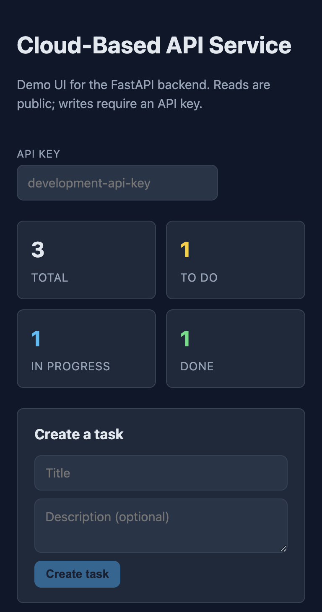

# Cloud-Based API Service

[](https://github.com/SoojalKumar/cloud-api-service/actions/workflows/tests.yml)
[](https://www.python.org/downloads/release/python-3110/)
[](LICENSE)

A small **FastAPI** service with **SQLite** persistence, **API key** auth, **versioned migrations**, and a **React + Vite + TypeScript** dashboard shipped in the **same Docker image** (API and UI on one origin). Built with incremental commits, full **pytest** coverage, and **GitHub Actions** (backend tests + frontend typecheck and production build on every push).

**Stack:** FastAPI · Pydantic · SQLite (repository pattern, threading-safe access) · React 18 · Vite 5 · TypeScript · Bun (lockfile) · Docker (multi-stage) · GitHub Actions

## Live demo

| | |
|-|-|
| **App** | <https://skvidhani-cloud-api-service.hf.space> |
| **Hugging Face Space** (build logs, files) | <https://huggingface.co/spaces/skvidhani/cloud-api-service> |
| **OpenAPI** | `/docs` on the app host |
| **Health** | `GET /api/v1/health` |
| **Demo write key** | `development-api-key` (paste in the UI for create / update / delete) |

On the free Spaces tier the filesystem is **ephemeral**; each cold start re-runs migrations and **seed-demo** so you always see three sample tasks. For GitHub → Space auto-sync, see [Hugging Face deployment](#hugging-face-deployment) below.

## Why this project (portfolio)

- **End-to-end resource API** — Tasks with validation, pagination, filters, and an aggregate summary backed by SQL (`GROUP BY`), not a capped in-memory count.
- **Ops-shaped defaults** — Request IDs, access logs, security headers (including `Content-Security-Policy: frame-ancestors` so the Hugging Face catalog can embed the demo), structured errors with optional `fields[]` on validation failures.
- **Testable app factory** — `create_app()` so tests can assert JSON root vs. static UI without a real `frontend/dist/`.
- **One container** — Multi-stage build: Bun builds the UI; Python serves it under `/` via Starlette `StaticFiles` when `frontend/dist` is present.
- **CI** — Pytest and frontend build run in parallel; a separate workflow can sync `main` to the Hugging Face Space when [secrets are set](#hugging-face-deployment).

See [docs/architecture.md](docs/architecture.md) for request flow and module layout.

## What’s in the box

- FastAPI bootstrap via `create_app()`; versioned routes under `/api/v1`
- Health and service metadata (DB readiness, process uptime)
- Task CRUD with SQLite, status filter, pagination, exact summary
- CORS, configurable via `CORS_ALLOWED_ORIGINS`
- Management CLI: migrations, seed-demo, config
- `Makefile` shortcuts; see [docs/operations.md](docs/operations.md)

## Run the server (local)

```bash
pip install -r requirements.txt
uvicorn app.main:app --reload
```

Open Swagger at <http://127.0.0.1:8000/docs>.

Without a built frontend, `GET /` returns JSON service metadata. With `frontend/dist/index.html` present (or `FRONTEND_DIST_DIR`), `/` serves the React app. Canonical metadata is always at `GET /api/v1/info`.

## API quick reference

| Method | Path | Auth |
|--------|------|------|
| `GET` | `/api/v1/health` | — |
| `GET` | `/api/v1/info` | — |
| `GET` / `POST` | `/api/v1/tasks` | `POST` needs `X-API-Key` |
| `GET` | `/api/v1/tasks?status=&offset=&limit=` | — |
| `GET` | `/api/v1/tasks/summary` | — |
| `GET` / `PATCH` / `DELETE` | `/api/v1/tasks/{id}` | writes need `X-API-Key` |

Task list summary:

```json
{ "total": 3, "todo": 1, "in_progress": 1, "done": 1 }
```

Example: create a task (local default key matches `.env.example`).

```bash
curl -X POST http://127.0.0.1:8000/api/v1/tasks \
  -H "Content-Type: application/json" \
  -H "X-API-Key: development-api-key" \
  -d '{"title":"Prepare deployment plan","description":"Document next production steps."}'
```

Example health response (local: `APP_ENV` defaults to `development`; the Docker image sets `APP_ENV=production`):

```json
{
  "status": "ok",
  "service": "Cloud-Based API Service",
  "version": "0.1.0",
  "environment": "development",
  "database": "ok",
  "uptime_seconds": 12.438
}
```

Validation error shape (HTTP 422):

```json
{
  "error": "validation_error",
  "message": "Request validation failed.",
  "request_id": "req-abc",
  "fields": [
    { "field": "body.title", "message": "Field required", "type": "missing" }
  ]
}
```

## Authentication

Write operations on `/api/v1/tasks` require the `X-API-Key` header (value from `API_KEY`). Read-only task endpoints are public in this demo.

## Persistence

Default database file: `cloud_api_service.db` in the project root. Set `DATABASE_PATH` for tests or production mounts.

## Error responses

Errors use a consistent JSON envelope: `error`, `message`, optional `request_id`, and for validation, optional `field`-level `fields`. Clients may send `X-Request-ID`; the API returns it in response headers. Responses also set baseline security headers; framing is controlled with `Content-Security-Policy: frame-ancestors` (see architecture doc) so approved embedders (e.g. Hugging Face) can iframe the app.

## Tests

```bash
python -m pytest
# or
make test
```

**35** tests cover: health/info; root behavior with and without `frontend/dist/`; repository and service (including summary beyond 1500 rows); task CRUD and errors; request IDs; security headers; environment parsing. Frontend: `cd frontend && bun run typecheck && bun run build` (also run in CI).

## Environment variables

```bash
cp .env.example .env
```

Key variables: `APP_NAME`, `APP_VERSION`, `APP_ENV` (`development` \| `test` \| `staging` \| `production`), `DATABASE_PATH`, `API_KEY`, `CORS_ALLOWED_ORIGINS`, `LOG_LEVEL`. See `.env.example`.

## Local operations

```bash
make migrate
make seed-demo
make run
make show-config
```

Or: `python -m app.cli migrate`, `python -m app.cli seed-demo`.

## Demo frontend



```bash
cd frontend
bun install --frozen-lockfile
bun run dev
```

Open <http://localhost:5173> with the API on port 8000 (Vite proxies `/api`, `/docs`, `/openapi.json`). Default key: `development-api-key`. Details: [frontend/README.md](frontend/README.md).

## Docker

Multi-stage image: Bun builds the UI; Python runtime copies `frontend/dist`, runs as non-root `appuser`, `APP_ENV=production`, `DATABASE_PATH=/app/data/cloud_api_service.db`. Startup: `migrate` → `seed-demo` → `uvicorn`.

```bash
docker build -t cloud-api-service .
docker run -p 8000:8000 cloud-api-service
```

Then: <http://127.0.0.1:8000/> (UI), <http://127.0.0.1:8000/docs> (OpenAPI). Mount a volume on `/app/data` if you need SQLite to survive restarts on your host.

## Hugging Face deployment

The **documented** public demo is **Hugging Face Spaces** only. To run the same image on your own machine or another host, use [Docker](#docker) — persist `/app/data` for SQLite, or set `DATABASE_PATH`.

**This instance (the links in the [Live demo](#live-demo) table):**

| What | URL |
|------|-----|
| Running app (React + API) | <https://skvidhani-cloud-api-service.hf.space/> |
| Space (logs, build, **Settings**, files) | <https://huggingface.co/spaces/skvidhani/cloud-api-service> |
| Space repo path on Hugging Face | `skvidhani/cloud-api-service` (Docker Space) |
| Config baked for HF | [`.github/hf_space_readme.md`](.github/hf_space_readme.md) — `sdk: docker`, `app_port: 8000` |

**How the GitHub → Space sync works**

The workflow is [`.github/workflows/deploy-hf-space.yml`](.github/workflows/deploy-hf-space.yml). On `push` to `main` (and manual `workflow_dispatch`):

1. The **Verify deploy secrets** step in the workflow tests `HF_TOKEN` and `HF_USERNAME`. If **either** is empty, the job **succeeds** but all later steps are **skipped** (no force-push, no failure).
2. If secrets are set: check out, copy [`.github/hf_space_readme.md`](.github/hf_space_readme.md) over the repo root `README.md`, commit, then **force-push** to `https://huggingface.co/spaces/<HF_USERNAME>/cloud-api-service` on branch `main`.
3. Hugging Face then rebuilds the **Docker** image from that repo; the `README.md` front-matter in the Space tells HF to use the Docker SDK and port **8000**.

**For this Space**, `HF_USERNAME` must be the Space owner, **`skvidhani`**, to match the URL above. The token: [Hugging Face → Settings → Access tokens](https://huggingface.co/settings/tokens) — create a **write** token, then in GitHub: **Repository → Settings → Secrets and variables → Actions** — add `HF_USERNAME` and `HF_TOKEN`. After the next push to `main`, the sync runs (or trigger **Actions → Deploy to Hugging Face Space → Run workflow**).

If you **fork** the repo, create a Docker Space under *your* account (same `cloud-api-service` name if you use the default workflow), set secrets to *your* HF username and token, and push to `main`.

## CI

Workflow [`.github/workflows/tests.yml`](https://github.com/SoojalKumar/cloud-api-service/blob/main/.github/workflows/tests.yml) on every **push and pull request** to `main`:

- **Run pytest** — full backend test suite.
- **Build frontend** — `bun install --frozen-lockfile`, `bun run typecheck`, `bun run build`.

Workflow [`.github/workflows/deploy-hf-space.yml`](https://github.com/SoojalKumar/cloud-api-service/blob/main/.github/workflows/deploy-hf-space.yml) runs on **push to `main`** (and can be run manually). It only performs the force-push to Hugging Face when both **`HF_USERNAME`** and **`HF_TOKEN`** are configured; otherwise it no-ops (see [Hugging Face deployment](#hugging-face-deployment)).

## Docs

- [docs/architecture.md](docs/architecture.md) — structure and request lifecycle  
- [docs/development.md](docs/development.md) — local workflow  
- [docs/operations.md](docs/operations.md) — Make/CLI, database, deploy notes
